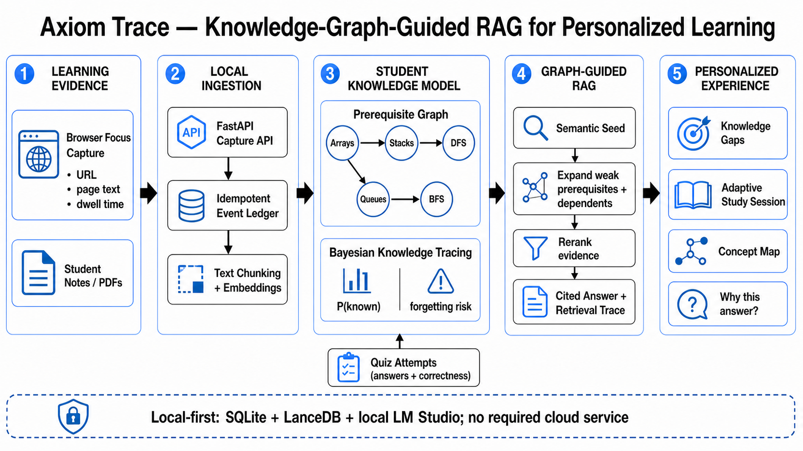

# Axiom Trace

**Knowledge-Graph-Guided RAG Transformer for Personalized Student Knowledge-Tracing**

Axiom Trace is a local-first adaptive learning platform that learns from the
student's notes and focused reading, builds a prerequisite graph, tracks concept
mastery, and explains why each piece of evidence was selected for a generated answer.



## Why it fits T2-2

- **Knowledge-graph-guided RAG:** retrieval expands the active concept into weak
  prerequisites and dependents before reranking evidence.
- **Personalized knowledge tracing:** Bayesian Knowledge Tracing estimates
  `P(known)` after attempts; confidence and forgetting risk guide the next step.
- **Evidence-aware:** the browser extension captures page text only after visible
  reading time and preserves provenance.
- **Explainable:** answers return citations, graph paths, expanded concepts, and
  a human-readable reason for each selected source.
- **Local-first:** SQLite, LanceDB, local files, and a local LM Studio endpoint are
  sufficient for the full demo.

## Run on Windows

Prerequisites:

- Python 3.12 and [uv](https://docs.astral.sh/uv/)
- LM Studio serving an OpenAI-compatible model at `http://localhost:1234/v1`
- pnpm, Bun, or npm

For the deterministic Computer Science demo:

```powershell
cd backend
uv run --frozen --python 3.12 python scripts/seed_axiom_trace_demo.py
cd ..
.\start-axiom-trace.ps1
```

Open [http://127.0.0.1:3000/learn](http://127.0.0.1:3000/learn). API docs are at
[http://127.0.0.1:8010/api/docs](http://127.0.0.1:8010/api/docs).

Stop both services with:

```powershell
.\stop-axiom-trace.ps1
```

The start script installs locked backend dependencies, installs web dependencies
when missing, launches both services in the background, waits for their health
checks, and writes logs and PID files under ignored `.run/`.

## Install the browser capture extension

1. Open `chrome://extensions` or `edge://extensions`.
2. Enable Developer mode.
3. Choose **Load unpacked** and select `integrations/browser-capture`.
4. Keep a supported HTTP(S) page visible for the configured dwell threshold.
5. Use the extension popup to inspect or send queued events.
6. In Adaptive Path, choose **Link new evidence** after ingestion.

The receiver accepts batches at `POST http://127.0.0.1:8010/api/captures` and
acknowledges event IDs so extension retries cannot create duplicate sources.

## Architecture at a glance

```text
Focused pages + notes
        ↓
Capture contract → canonical item/chunk ingestion → SQLite + LanceDB
        ↓                                      ↓
Attention evidence                     prerequisite graph
                                               ↓
Question + active concept → weak-neighbor expansion → Qwen reranker
                                               ↓
                              cited answer + retrieval trace
                                               ↓
Quiz attempt → Bayesian mastery + forgetting risk → next learning action
```

The full component map, design decisions, data flow, algorithm, and privacy
boundary are in [docs/SUBMISSION_ARCHITECTURE.md](docs/SUBMISSION_ARCHITECTURE.md).

## Repository map

| Path | Purpose |
| --- | --- |
| `backend/core/graph_rag.py` | Personalized graph expansion, evidence union, reranking, and trace generation |
| `backend/core/mastery.py` | Bayesian mastery and forgetting model |
| `backend/core/capture.py` | Browser event sanitization and canonical ingestion |
| `backend/server.py` | FastAPI contracts for capture and adaptive learning |
| `web/src/app/learn` | Focused learning workflow |
| `integrations/browser-capture` | Manifest V3 attention-aware capture adapter |
| `backend/scripts/seed_axiom_trace_demo.py` | Repeatable local demo story |
| `docs` | Architecture, runbook, evaluation, and presentation image |

## Verify

Backend focused suite:

```powershell
cd backend
uv run --frozen --python 3.12 python -m pytest -q `
  tests/test_capture.py tests/test_demo_seed.py tests/test_graph_rag.py `
  tests/test_vectorstore.py tests/test_rag.py tests/test_gaps_planner.py `
  tests/test_quiz_concepts.py tests/test_mastery.py tests/test_server_api.py
```

Web interface:

```powershell
cd web
pnpm run lint
pnpm exec tsc --noEmit
pnpm run build
```

Browser extension:

```powershell
node integrations/browser-capture/tests/background.test.js
node integrations/browser-capture/tests/settings.test.js
node --check integrations/browser-capture/background.js
node --check integrations/browser-capture/content.js
node --check integrations/browser-capture/popup.js
```

See [docs/EVALUATION.md](docs/EVALUATION.md) for what each check proves and
[docs/DEMO_RUNBOOK.md](docs/DEMO_RUNBOOK.md) for the judge-facing walkthrough.

## Scope discipline

Axiom Trace uses pretrained transformer models for embeddings, reranking, and
local answer generation; it does not claim to train a new foundation model. The
primary T2-2 navigation stays focused on evidence, mastery, graph retrieval, and
adaptive study sessions.
