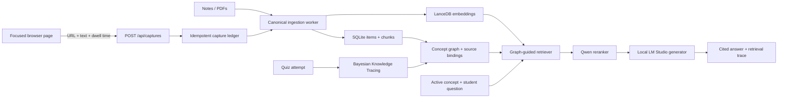

# Axiom Trace system architecture

## One-sentence product definition

Axiom Trace is a local-first personalized learning system that turns notes and
attention-qualified browser reading into a prerequisite graph, estimates each
student's concept mastery, and expands RAG retrieval through the weak knowledge
paths that matter to that student.

## Design principles

- **One system of record:** one FastAPI backend, one item/chunk ingestion pipeline,
  one SQLite metadata database, and one LanceDB vector index.
- **Evidence before generation:** notes, documents, and attention-qualified browser
  reading enter the same validated ingestion contract.
- **Personalization in retrieval:** concept prerequisites, mastery, and forgetting
  risk influence which evidence is selected for each student.
- **Explainable by construction:** every answer returns citations, graph paths, and
  a human-readable reason for each selected source.
- **Local-first operation:** the complete demonstration runs without a required
  cloud service.

## Runtime components

1. **Browser evidence adapter** — captures visible text only after a configurable
   attention threshold, then batches events to the local API.
2. **Capture contract** — validates browser-only events, caps batch and text size,
   acknowledges event IDs, and makes retries idempotent.
3. **Canonical ingestion** — stores captured text as a normal source item so the
   existing chunking and embedding worker can process it.
4. **Student knowledge model** — stores concepts, prerequisite edges, bound source
   chunks, mastery posteriors, attempt history, and forgetting state.
5. **Graph-guided retriever** — starts from the active concept, selects the weakest
   immediate prerequisites and dependents, merges their bound chunks with semantic
   candidates, deduplicates, reranks, and orders context pedagogically.
6. **Grounded generator** — sends only selected evidence to the configured local
   LM Studio model and returns citations plus a retrieval trace.
7. **Adaptive interface** — presents gaps, graph, mastery, study sessions, captured
   evidence, and a “Why this answer?” explanation.

## Main data flow

## Retrieval algorithm

Given concept `c` and question `q`:

1. Load `c` from the current goal's directed acyclic prerequisite graph.
2. Select up to four weakest immediate prerequisites and four weakest dependents,
   ordered by `p_known`.
3. Take up to three source chunks per expanded graph node.
4. Retrieve semantic candidates for `q` from LanceDB.
5. Union by chunk ID, preferring the strongest graph role when a chunk repeats;
   cap the candidate pool at 24.
6. Rerank with the configured Qwen reranker and retain the requested top K.
7. Place evidence into the prompt in prerequisite, target, dependent, then
   semantic-seed order.
8. Return the answer, citations, graph paths, expanded concepts, and a reason for
   every evidence selection.

If LanceDB is absent or temporarily unavailable, graph-bound evidence still
produces a grounded retrieval path. If no graph evidence exists, the mode is
reported as `vector_fallback` rather than silently claiming graph guidance.

## Personalization loop

Quiz observations update `P(known)` with Bayesian Knowledge Tracing. Attempt
count supplies confidence; weak prerequisites are surfaced as gaps; mastered
concepts enter spaced review; exponential half-life estimates forgetting risk.
These values influence both what the student studies next and which neighboring
concept evidence is expanded during retrieval.

## Trust and privacy boundary

- All required persistence is local: SQLite, source files, and LanceDB.
- Generation targets a local OpenAI-compatible LM Studio endpoint by default.
- The browser extension accepts only explicit HTTP(S) pages, extracts visible
  content, enforces size limits, and posts only to the loopback API.
- No cloud service is required for the T2-2 demonstration.

## Honest scope

This project does not claim to train a new foundation transformer. It implements
the theme as a transformer-backed RAG system whose retrieval is explicitly
guided by a personalized knowledge graph. The novel system behavior is the
closed loop between attention-qualified evidence, prerequisite structure,
student mastery, and explainable retrieval.
